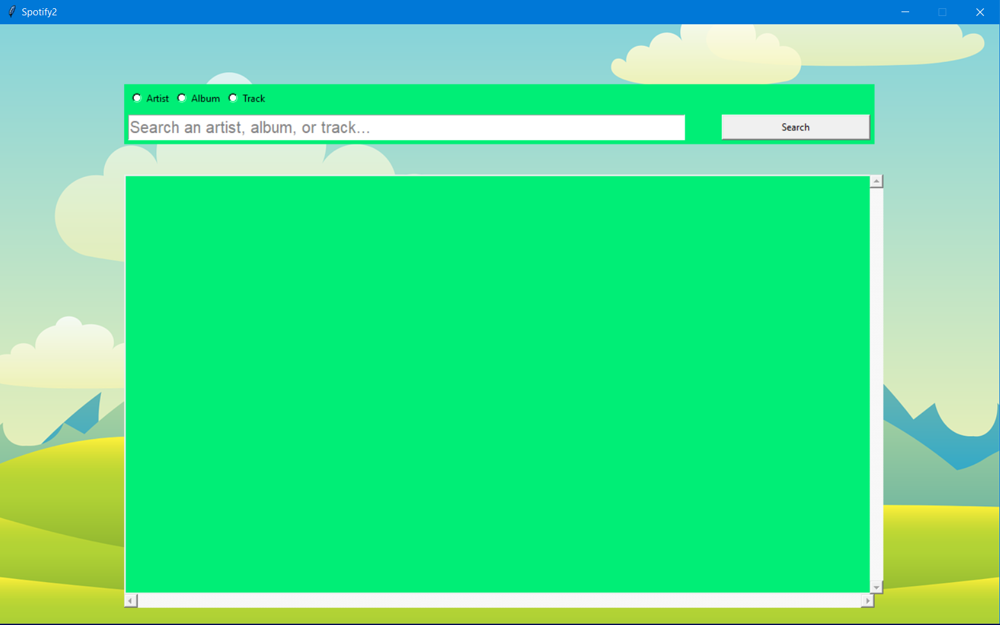
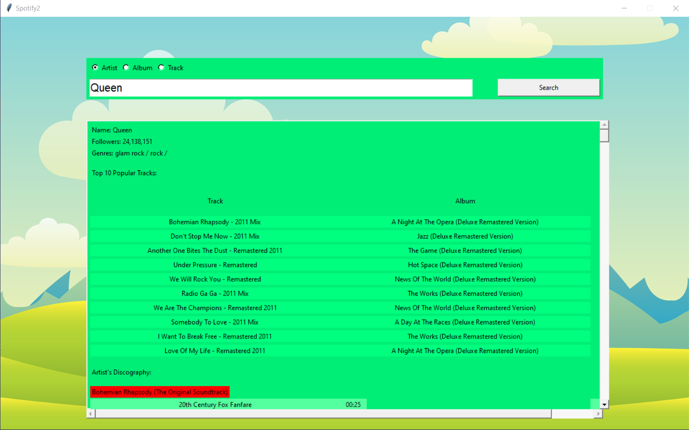
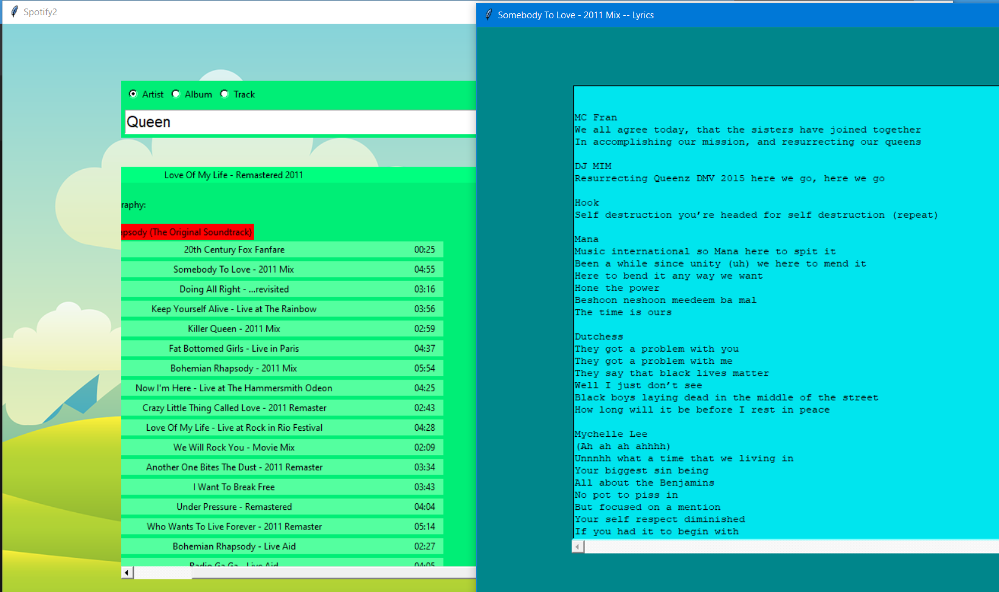

## SpotifyProj ##
SpotifyProj is a basic music player that can play a song from Spotify and display the accompanying lyrics. When searching for an artist, it first lists the Top 10 songs of the artist and then it lists the artist's discography. When searching an album, all of the albums that matched search words will be displayed. When searching for a song, all songs that match the search words will be displayed. All of the tracks displayed have the option to be played by clicking the "PLAY" button. When the "PLAY" button is clicked, a window containing the lyrics of the song will be displayed.

spotify2.py served as an outline of what the app was going to be. It simply made the requests and printed the results onto the console.
spotifyApp.py uses all of the existing code of spotify2.py and it adds the user interface classes using the tKinter library.

## Motivation ##
The desktop version of Spotify does not provide the lyrics of songs. SpotifyProj tries to fix this problem by getting the lyrics of songs
using Genius's API.

## Requirements ##
- Spotify API key, Genius API key

## Screenshots ##

## Improvements ##
-A "PAUSE" feature
-A better looking player, definitely use something other than tKinter fro the user interface
-There are some songs for which Genius does not have the lyrics of, so it would be a good idea to display this issue to the user

